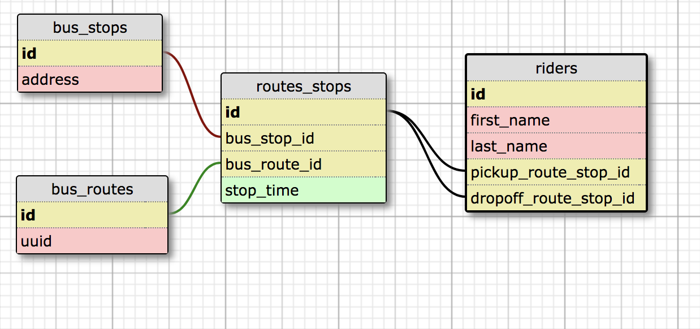

# Bus Route Importer

This starter API provides an ETL rake task to load CSV data into a PostgreSQL
database.


## Installation

1. Clone this repository and `cd` into it.
2. Run `bundle install && rake db:{create,migrate}`
3. Run `rspec`

## Importing CSV data

To import CSV data into the database, run the following rake task:

```shell
rails db:import_bus_route_data[<FILENAME>]
```

...where `<FILENAME>` is a path to a `.csv` file relative to the current
directory of your terminal session (most likely the root of the rails project).

The rake task takes care of error guarding and loading the CSV file into a
native Ruby `CSV::Table` object. This table is then passed to
`BusRouteImporter.main`, which handles the the database logic.

If an updated form of the same CSV is passed, existing records are updated.

### The CSV "duck-type" includes the following columns:

```
Last Name
First Name
Pickup Route
Pickup Time
Pickup Bus Stop
Dropoff Route
Dropoff Time
Dropoff Bus Stop
```

Which are converted to:

```
last_name
first_name
pickup_route
pickup_time
pickup_bus_stop
dropoff_route
dropoff_time
dropoff_bus Stop
```

## Database Schema

The CSV data are used to create three models: `Rider`, `BusRoute`, and
`BusStop`.

* A `BusStop` has many `BusRoute`s through `RouteStop`s
* A `BusRoute` has many `BusStop`s through `RouteStop`s
* A `Rider` has one pickup `RouteStop`
* A `Rider` has one dropoff `RouteStop`
* A `RouteStop` has many `Rider`s



## Functional Programming Style

The `import_bus_route_data` task and `BusRouteImporter` employ a functional
programming approach because scope of the task is to take an input and produce
some ultimate output, in this case a database writing side effect. One pattern
you'll see involves creating pipeline of `lambda`s (composing left to right)
whose return values are passed to the next `lambda`. See `lib/fun` for the
source code. You'll also find some wrapping data structures like Maybe Just, and
Nothing, which facilitate a more declarative style of chaining functions.
